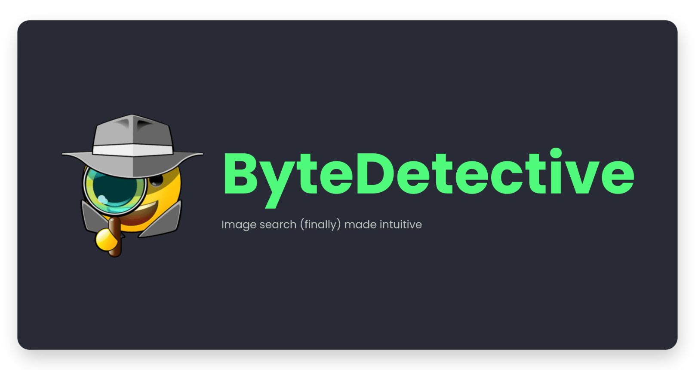

## What is ByteDetective?
ByteDetective is a **desktop app** (currently available for MacOS) that acts as a **semantic search engine for your photos**. The aim is to make searching for images on your desktop quick and easy. 

**Images are difficult to search**; they often don't have a really intuitive filename, and you have to dig a lot to find them. Wouldn't it make more sense to search for them **based on their content** (e.g "eating pizza with friends")?

Why it's cool:
- 📁 **Ease of use**: Say goodbye to the endless struggle of navigating through countless files and folders to find that one picture
- 🔮 **Intelligent**: Even if your description is vague, ByteDetective will deliver pretty decent results, unveiling images that match your vision
- ⚡ **Fast**: Experience lightning-fast performance as the "inference" is powered by Rust, ensuring optimal efficiency.

## How it works

## How to use
1. Download the release.
2. Open it.
3. Let it open a few hours. It takes a bit of time to scan all the images on your computer at first. From then, it will get faster and sync with new images on the fly. 
